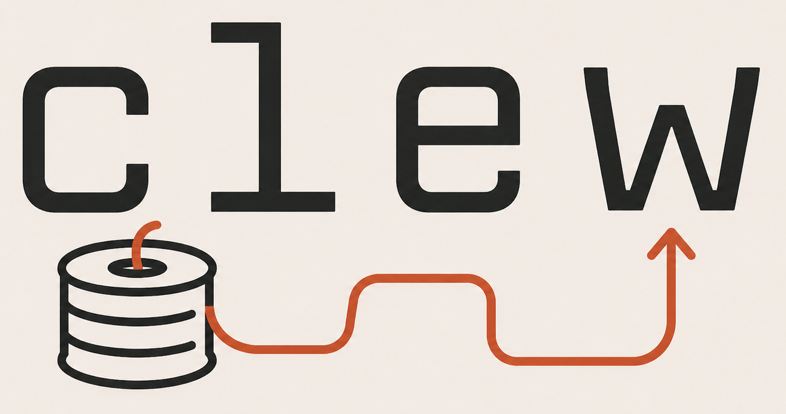

# Clew

In Greek myth, Ariadne gave Theseus the "clew" (a ball of thread) to navigate the labyrinth so he could find his way back out. This Clew is built to help us navigate the twists and turns of our own projects.

There are endless ways to manage software projects, if the below resonates, maybe this one suits you as well.



### Clew is designed to:

- support hobby projects or tiny teams
- be as simple as possible while pursuing a goldilocks zone of features and capabilities
  - _(very much inspired by [Rich Hickey's talk "Simple Made Easy"](https://www.youtube.com/watch?v=LKtk3HCgTa8))_
- be optimized for agents and humans equally
  - CLI-first _(nice TUI or even a full GUI possible later)_
  - human readable
- agent harness agnostic
  - easily support swapping harnesses frequently in the same project
- run locally without any cloud or subscription service required
- aid in using as few tokens as possible
  - Push as much work as possible to deterministic software (Clew CLI)
  - aids agent session:session handoffs efficiently
- enable tracking/adding to a backlog of work, taggable by humans or agents
- integrate well with git
  - be a part of the respective project repo
  - rely on your git remote of choice for cloud syncs / backups

#### What Clew is not:

- Clew isn't designed for token or parallel agent maxing. At the time of design (April 2026), my workflows centered around one maaaybe two primary agents; starting new sessions after each 'stable' increment of work. These primary agents can and often spin up sub-agents, but more for token efficiency than tackling parallel units of tracked work from a project management stand point
  - e.g. 'scout' sub-agents are great at efficiently getting context from the code base, but they aren't tackling features on their own etc...
- based on any specific school of thought of SCRUM or any other such over-sold consulting product.
- trying to replace enterprise tooling like Jira, or compete with broader knowledge systems like Monday.com or ClickUp; it's for individuals or tiny teams and their agents.

### Core Concepts

- **Task** — The most atomic unit of work. A single action or reminder. Lives as a checkbox inside an increment, never as its own file.
- **Increment** — A standalone unit of work containing zero or more tasks. When completed, the goal is for the codebase to be stable, tested, linted, and safely committable. This is the unit of work an agent typically completes in a session. _[1 session : 1 Increment] is an encouraged pattern, but not required_
- **Epic** — A larger body of work consisting of two or more increments that must ship together for the new functionality to work.
- **Relay** — An ephemeral transition of context between agent sessions. Captures what doesn't live anywhere else _(discoveries, next-actions, open questions etc...)_.

### Essential Workflows for Agents

_Recommended agent context: copy this table into your `AGENTS.md` or `CLAUDE.md`._

| Need                | Clew command                                                               | Why it matters                                                                 |
| ------------------- | -------------------------------------------------------------------------- | ------------------------------------------------------------------------------ |
| See available work  | <pre>./clew list</pre>                                                     | Gives the canonical local backlog without reading hidden files.                |
| Narrow the queue    | <pre>./clew list --status todo</pre><br><pre>./clew list --tag bug</pre>   | Lets agents pick relevant work without guessing priorities.                    |
| Read the full issue | <pre>./clew show 0024</pre>                                                | Loads the complete increment: goal, notes, tasks, and acceptance criteria.     |
| Create a new issue  | <pre>./clew new "Short title" &lt;&lt;'EOF'<br>## Goal<br>...<br>EOF</pre> | Captures work in the repo, in plain markdown, with an allocated ID.            |
| Label work          | <pre>./clew tag 0024 bug p0<br></pre><pre>./clew untag 0024 p0</pre>       | Keeps triage lightweight and visible to humans and agents.                     |
| Start work          | <pre>./clew start 0024</pre>                                               | Marks ownership and makes the active increment explicit.                       |
| Finish stable work  | <pre>./clew done 0024</pre>                                                | Archives the completed increment after tests pass and the repo is committable. |

## Installation

Clew's release path is being wired with `dist`. Once the first public release is cut, the supported install paths are:

```bash
# Homebrew tap (after the tap repo is created)
brew install npatten/tap/clew

# Shell installer from the latest GitHub Release
curl --proto '=https' --tlsv1.2 -LsSf \
  https://github.com/npatten/Clew/releases/latest/download/clew-installer.sh | sh

# Rust fallback
cargo install clew
```

Until the crate is published, install from source with:

```bash
cargo install --git https://github.com/npatten/Clew.git
```

Windows: use WSL2 for the release artifacts. Native Windows / Git Bash distribution is still experimental and is not advertised until the Windows smoke tests pass.

### Self-hosting development

In this repository, `./clew` is a thin launcher for a promoted stable binary at `.clew/bin/clew`. It does not run `cargo build` on every invocation, so Clew remains available while the working tree is temporarily broken.

After a successful increment, promote the current source build with:

```bash
scripts/promote-clew
```

That script runs `cargo fmt --check`, `cargo clippy --all-targets -- -D warnings`, `cargo test`, builds the release binary, and copies it to `.clew/bin/clew`. The promoted binary is local-only and ignored by git.

## Agent Use Highlights

```bash
for id in 0002 0003 0005 0008 0010 0012 0014 0018 0019 0021 0022 0023 0024 0025 0026 0027; do echo "--- $id ---"; ./clew show $id; done
```
